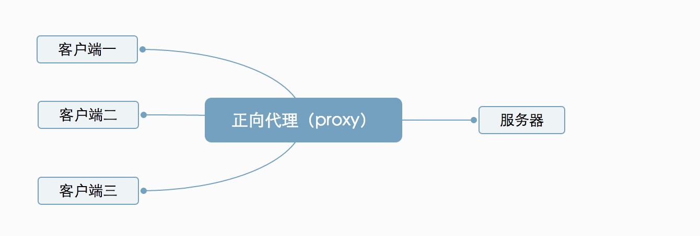
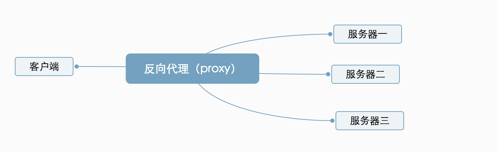
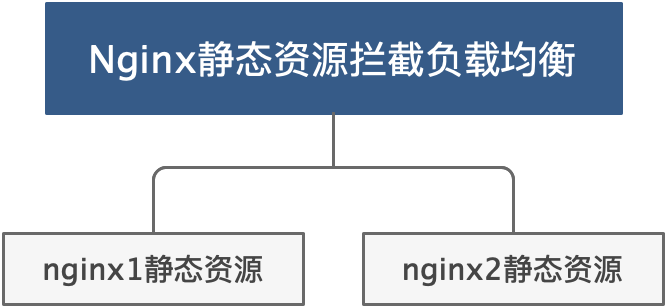
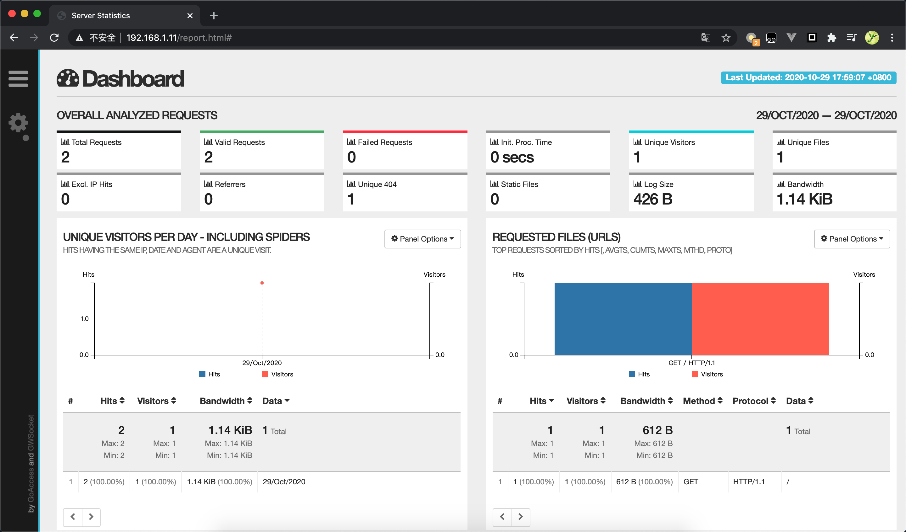
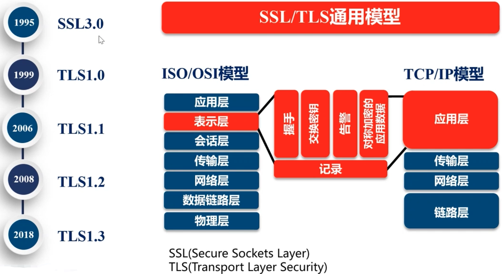
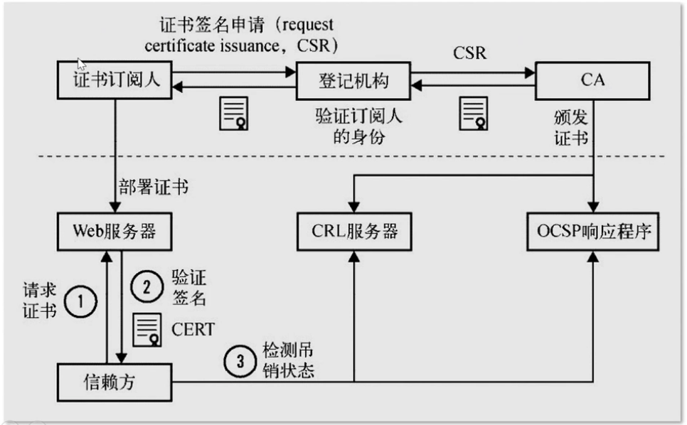
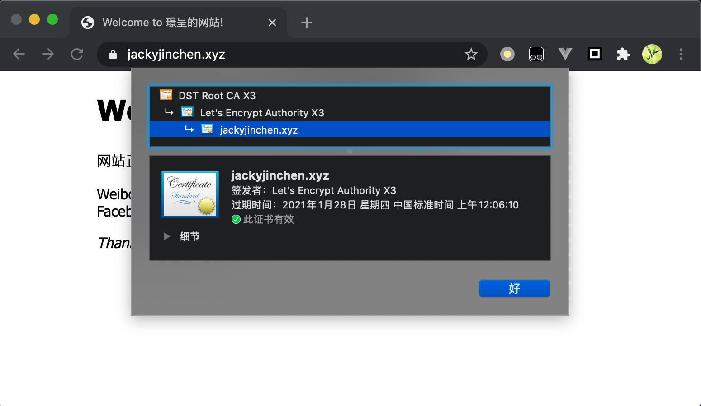

# Nginx

高性能Web服务器和反向代理服务器

其他：Apache、Lighttpd、Tengine(阿里巴巴)......

## 正向代理

隐藏了真实的请求客户端，服务端不知道真实的客户端是谁，客户端请求的服务都由代理服务器代替来请求



## 反向代理

反向代理隐藏了真实的服务端，当我们请求的时候，反向代理服务器会帮我们把请求转发到真实的服务器那里去。



## Nginx组成

1. Nginx			二进制可执行文件
2. Nginx.conf   配置文件
3. access.log     访问日志
4. error.log        错误日志

## 编译安装

安装依赖库

```shell
yum install gcc openssl openssl-devel pcre pcre-devel zlib zlib-devel -y
```

正式安装

```shell
#解压缩
wget http://nginx.org/download/nginx-1.18.0.tar.gz
tar -zxvf nginx-xxxx.tar.gz
cd nginx-xxxx

```


1. auto 安装cc、库lib、系统版本os等
2. 示例conf文件
3. 生成中间文件，编译前动作
4. contrib 提供，两个脚本和vim工具

```shell
#使配置文件彩色
cp -r contrib/vim/* ~/.vim/
```

5. html 默认2个html界面
6. man 帮助文件

```shell
man ./nginx.8
```

7. src 源代码

### 编译

```shell
#执行configure文件
./configure --help | more
# 主要需要设定的安装目录地址
./configure --prefix=/usr/local/nginx
#编译构建
make
make install
```

**执行configure文件后生成了objs文件夹，确定了会被编译进的modules**

**在make后objs文件会生成nginx的执行文件，供版本升级时使用。**

## Nginx服务

### 目录结构

| 安装目录/usr/local/nginx                   |
| ------------------------------------------ |
| conf：配置文件--nginx.conf                 |
| html：50x.html错误地址，index.html欢迎页面 |
| logs：日志                                 |
| sbin：nginx启动命令                        |

### 命令行

```
帮助 -？ -h
指定配置文件 -c
指定配置命令 -g
指定运行目录 -p
发送信号 -s
    立即停止服务: stop
    优雅的停止服务: quit
    重载配置文件: reload
    重新开始记录日志文件: reopen
检查配置文件是否有语法错误: -t -T
打印nginx版本信息: -v -V
```

### 启动

默认端口80，直接访问即可

```shell
#直接启动
/usr/local/nginx/sbin/nginx
#通过配置文件启动
/usr/local/nginx/sbin/nginx -c /usr/local/nginx/conf/nginx.conf
```

### 停止

```shell
ps -ef | grep nginx
# 优雅关闭，处理完请求后再关闭
Kill -QUIT 主pid
# 快速关闭，直接关闭所有请求
kill -TERM 主pid
```

### 重载

```shell
./nginx -s reload
```

### 热部署

```shell
# 备份
cp nginx nginx.old
# 将编译的objs中的nginx复制到安装目录sbin中覆盖
cd ~/nginx-1.18.0/objs/
cp -r nginx /usr/local/nginx/sbin/ -f
# 覆盖后通过指令热部署 会通过新的nginx文件生成新的进程并过渡
kill -USR2 老的nginx-master进程号
# 当新的部署完成后，关闭老的进程
kill -WINCH 老的nginx-master进程号
```

### 日志切割

```shell
# 备份日志
cp access.log bak.log
# 重新开始记录文件
../sbin/nginx -s reopen
```

### 配置检查

```shell
/usr/local/nginx/sbin/nginx -c /usr/local/nginx/conf/nginx.conf -t
# -t 若错误会报错
```


## Nginx配置文件

nginx官方帮助文档：http://nginx.org/en/docs

具体注解见nginx.conf

### autoindex

官方提供的组件ngx_http_autoindex_module，可以显示location目录结构

```shell
location / {
    alias dlib/; #nginx安装目录下的dlib文件夹
    autoindex on;
}
```

### limit_rate

在ngx_http_core_module中提供，进行连接限速

```shell
location / {
    alias dlib/; #nginx安装目录下的dlib文件夹
    set $limit_rate 1k; #限制访问每秒1k
}
```


## Nginx应用

静态网站部署
负载均衡
静态代理
动静分离
虚拟主机

### 静态网站部署

```conf
# 路径/opt/www/ace/login.html
location /ace {
    root  /opt/www;
    index login.html;
}
```

### 负载均衡

**硬件负载均衡**：F5、深信服、Array等

**软件负载均衡**：Nginx、LVS、HAProxy

#### nginx负载均衡策略：

1. 默认轮询模式及权重模式

```conf
# 服务器端口地址 weight表示权重比
upstream backserver {
    server 192.168.0.1:8081 weight=3;
    server 192.168.0.1:8082 weight=1;
}
# 请求分发
location /myweb {
    proxy_pass  http://backserver
}
```

2. ip_hash

IP绑定，根据访问ip的hash值分配，每个访问客户会固定一个访问后端服务器，解决会话session丢失的问题。（动态ip无法解决）

```conf
upstream backserver {
    ip_hash;
    server 192.168.0.1:8081 weight=3;
    server 192.168.0.1:8082 weight=1;
}
```

3. 最少连接数

```conf
upstream backserver {
    least_conn;
    server 192.168.0.1:8081;
    server 192.168.0.1:8082;
}
```

#### 负载均衡的其他配置：

1. 备份服务：可用于服务更新

```conf
upstream backserver {
    server 192.168.0.1:8081;
    # 此服务器为备份服务器，当其他服务器均宕机后启用
    server 192.168.0.1:8082 backup;
}
```

2. 不参与负载均衡

```conf
upstream backserver {
    server 192.168.0.1:8081;
    # 此服务器down状态，不参与负载均衡
    server 192.168.0.1:8082 down;
}
```

### 静态代理

将静态资源从tomcat中抽离出来，nginx更擅长静态资源处理，性能效率更高。

1. 拦截扩展名

静态资源目录权限需要足够，否则会出现403错误，chmod 755

```conf
location ~ .*\.(js|css|htm|html|gif|jpg|jpeg|png|bmp|swf|ioc|rar|zip|txt|flv|mid|doc|ppt|pdf|xls|mp3|wma)${
    root /opt/static;
}
# ~正则匹配
# .表示任意字符
# *表示一个或多个字符
# \.是转义字符，是后面这个点的转义
# |表示或者
# $表示结尾
```

2. 拦截路径

```conf
location ~ .*/(css|js|img|images){
    root  /opt/static;
}
```

### 动静分离

```shell
#tomcat启动
./startup.sh | tail -f ../logs/catalina.out &
```

通过proxy进行负载均衡（针对丢失session问题，采用ip_hash方式），访问前端服务（静态资源通过nginx拦截访问），并调用后端服务。



### 虚拟主机

1. 基于端口的虚拟主机(较少采用)

```conf
server {
		#采用不同的端口
    listen 8080;
    server_name www.myweb.com;
    location /myweb {
        proxy_pass http://www.myweb.com;
    }
}
```

2. 基于域名的虚拟主机

```conf
server {
    listen 80;
    #采用相同的80端口 dns绑定不同的域名访问相同的服务
    server_name www.myweb.com;
    location /myweb {
        proxy_pass http://www.myweb.com;
    }
}
```

## 搭建具有缓存的nginx反向代理

1. 在nginx上游服务上使其只供内部使用

```conf
server {
    # 仅本地能够访问此nginx服务
    listen 127.0.0.1:80;
}
```

2. 在nginx反向代理服务进行设置

```conf
upstream local {
    server 127.0.0.1:8080;
}

server {
    server_name test.com;
    listen 80;
    
    location / {
        proxy_set_header Host $host;
        # 将远端ip地址发送给上游服务器
        # 具体配置见ngx_http_proxy_module
        proxy_set_header X-Real-IP $remote_addr;
        proxy_set_header X-Forwarded-For $proxy_addr_x_forwarded_for;
        
        proxy_pass http://local;
    }
}
```

缓存配置：

```conf
http {
    #缓存地址配置：共享内存10m 最大量10g key等配置信息...
    proxy_cache_path /tmp/nginxcache levels=1:2 keys_zone=my_cache:10m max_size=10g inactive=60m use_temp_path=off;

  server {
      ....
      location / {
          proxy_cache my_cache;
          # 和host用户 url资源 等有关
          proxy_cache_key $host$url$is_args$args;
          proxy_cache_valid 200 304 302 1d;
          proxy_pass http://local;
      }
  }
}

```

## GoAccess

**GoAccess** 是一款开源的且具有交互视图界面的**实时** **Web 日志分析工具**

英文站: https://goaccess.io

中文站: https://goaccess.cc

```shell
# 环境依赖
yum install -y GeoIP-devel
yum install -y ncurses-devel
$ wget http://tar.goaccess.io/goaccess-1.2.tar.gz
$ tar -xzvf goaccess-1.2.tar.gz
$ cd goaccess-1.2/
$ ./configure --enable-utf8 --enable-geoip=legacy
$ make
# make install
```

GoAccess指令：https://goaccess.io/get-started

```shell
goaccess access.log -o ../html/report.html --real-time-html  --time-format='%H:%M:%S' --date-format='%d/%b/%Y' --log-format=COMBINED
```

```shell
#配置location并重启nginx
location /report.html {
            alias /usr/local/openresty/nginx/html/report.html;
        }
```



## 利用免费SSL实现HTTPS站点

### TLS/SSL发展



TLS安全密码套件


PKI公钥基础设施



证书类型：

1. 域名验证（domain validated ，DV）
2. 组织验证（organization validated，OV）
3. 扩展验证（extended validation，EV）

### 配置SSL证书

```shell
#在CentOS下安装EPEL支持
sudo yum -y install yum-utils
sudo yum install https://dl.fedoraproject.org/pub/epel/epel-release-latest-7.noarch.rpm
#安装CertBot
yum install python2-certbot-nginx
# nginx需要ssl module。重新编译
./configure --prefix=/opt/nginx --with-http_ssl_module
# 软连接
# sudo ln -s /usr/local/nginx/sbin/nginx /usr/bin/nginx
#获取签名
certbot --nginx --nginx-server-root=/usr/local/nginx/conf/ -d www.jackyjinchen.tk
```

可能出现的问题：

```shell
# 若出现 urllib3问题，版本不够
$ sudo pip2.7 install requests urllib3  --force --upgrade
#pyOpenSSL版本过低
sudo pip install pyOpenSSL --upgrade --ignore-installed pyOpenSSL
# 
mv /usr/lib64/python2.7/site-packages/OpenSSL /usr/lib64/python2.7/site-packages/pyOpenSSL
# 无法访问
# 注意云服务器是否打开了443https端口
```



